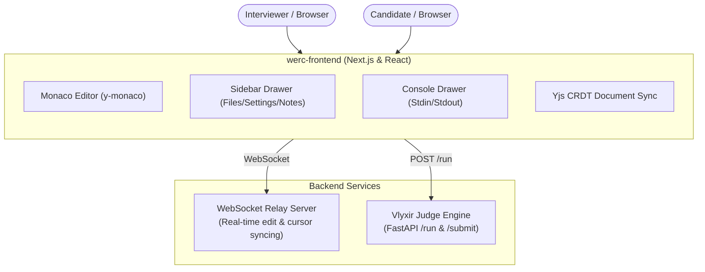

# WeRC: Collaborative Technical Interview Platform

Welcome to WeRC, a modern, real-time collaborative coding and technical interviewing platform. Designed to provide a seamless interview experience for both candidates and interviewers, WeRC combines high-performance sandboxed code execution with a collaborative IDE workspace.

WeRC integrates the Vlyxir Judge Backend Engine to support lightning-fast execution of single-file or complex multi-file projects with custom standard inputs.

---

## Features

- **Real-Time Collaboration**: Google Docs-style collaborative editor powered by Yjs (CRDTs) and WebSocket relay synchronization.
- **Draggable Workspace**: A customizable Monaco-based editor (VS Code engine) with resizable sidebars, console drawer, layout modes, and custom theme presets (Light / Dark).
- **Multi-file & Folder Structure**: Supports full project structures inside the workspace, allowing folders, subfiles, custom entrypoints, and filename/folder renames.
- **Isolated Code Execution (Vlyxir Forge)**: Runs candidate's code in a sandboxed Python execution engine with standard input (stdin) parsing and custom entrypoints.
- **Interviewer Workspace**: Dedicated space for private interviewer notes, progression, and control widgets that do not disrupt the candidate.
- **Profile & Session Management**: Built-in profile menus, session settings, and account controls.

---

## Architecture Overview

The platform is designed around two main layers: the collaborative Next.js application and the sandboxed Python FastAPI code runner.



---

## Tech Stack

- **Frontend**: Next.js 15+ (TypeScript) + Monaco Editor (@monaco-editor/react) + Tailwind CSS
- **Real-Time Collaboration**: Yjs + WebSocket Relay
- **Sandbox Engine**: Python 3.10+ + FastAPI (Vlyxir Engine)

---

## Getting Started

### 1. Configure the Frontend
Move into the `werc-frontend` directory and install the necessary dependencies:

```bash
cd werc-frontend
npm install
```

Configure your environment variables in a `.env.local` file:
```env
NEXT_PUBLIC_JUDGE_API_URL=http://localhost:5000
```

Run the local development server:
```bash
npm run dev
```

Open `http://localhost:3000` to access the collaborative IDE dashboard.

### 2. Configure the Backend (Vlyxir Engine)
Refer to the instructions inside the backend documentation to boot the runner engine:

```bash
cd werc-backend # or the path to your FastAPI code executor
pip install -r requirements.txt
python app.py
```
By default, the engine boots on port `5000` to serve sandbox execution requests.

---

## Project Structure

```bash
├── artifacts/          # Project roadmaps, documentation, and API specifications
├── werc-backend/       # WebSocket server and session management
└── werc-frontend/      # Next.js collaborative editor client application
```

---

## Roadmap & Future Phases

- [x] **Phase 1**: Foundations & Monaco Editor Workspace integration.
- [x] **Phase 2**: Multi-file workspace configuration, renaming, and custom entrypoint execution.
- [ ] **Phase 3**: Real-Time state replication (WebSocket + Yjs integration for two-way collaboration).
- [ ] **Phase 4**: Sandbox dockerization for secure multi-tenant execution.
- [ ] **Phase 5**: WebRTC-based direct video/audio calling.

---

*Made for the collaborative engineering community.*
